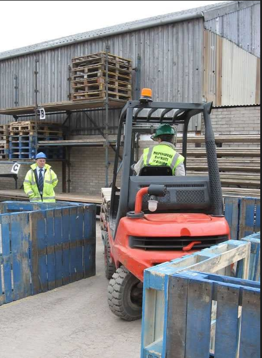
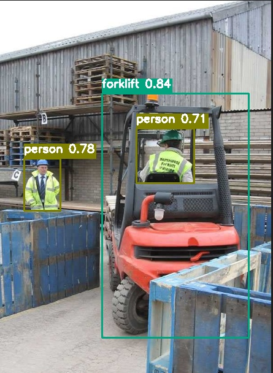

<p align="center">
 <strong>Cognifork</strong>
</p>

**Cognifork** is a cutting-edge vision solution designed to empower automobile companies with real-time detection capabilities. 🏭 Utilizing the powerful YOLOv8 model from Ultralytics, Cognifork is capable of detecting humans, vehicles, and forklifts with precision and speed, making it an essential tool for workplace safety and operational efficiency.

---

### Features 🚀

- **Real-Time Detection**: Instantly tracks humans 🧑‍🤝‍🧑, vehicles 🚗, and forklifts 🏗️ in videos, images, and live camera feeds.
- **Powered by YOLOv8**: High-accuracy, fast, and robust detection powered by Ultralytics.
- **OpenCV Integration**: Handles diverse inputs, optimizes pipelines, and ensures smooth performance.
- **Automobile-Focused Design**: Enhances workplace safety and operational monitoring in industrial environments.

---

### How It Works 🔍
1. **Input**: Provide video files, images, or connect a live camera feed. 📥
2. **Processing**: Analyzes frames using YOLOv8 for object detection. 🖥️
3. **Output**: Delivers precise detection results for humans, vehicles, and forklifts. 📤

---

### Demo 🖼️

<p align="center">
  
  
</p>

---

### Use Cases 🏭

- **Workplace Safety**: Prevent accidents by detecting forklifts and humans in shared spaces. 🛡️
- **Operational Monitoring**: Track vehicle movements and human activity. 📊
- **Automation Support**: Enable advanced automation through accurate object detection. 🤖

---

### Installation 🛠️

#### Prerequisites
- Python 3.8 or higher 🐍
- Pip package manager 📦

#### Steps
1. Clone the repository:
   ```bash
   git clone https://github.com/Varsha010101/Cognifork.git

2. Navigate to the project directory:
    ```bash 
    cd Cognifork 
3. Install dependencies:
    ```bash 
    pip install ultralytics
    pip install ultralyticsplus
    pip install opencv-python
    pip install opencv-contrib-python

4. Run the application:
    ```bash
    python det.py
    
---

### Contributing 🌟
We welcome contributions to make Cognifork even better! Feel free to:

- Report issues 📋
- Submit feature requests 💡
- Contribute code improvements 🔧

---

### License 📝

Cognifork is licensed under the MIT License. Feel free to use, modify, and distribute it in accordance with the license terms.

---

### Acknowledgments 🤝
- *Ultralytics YOLOv8* for the backbone object detection model. 🤖
- *OpenCV* for image and video processing capabilities. 🎥

---

